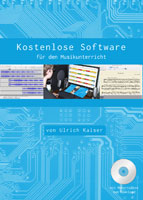

# OpenBook 'Kostenlose Software'

Citation: Ulrich Kaiser, Kostenlose Software für den Musikunterricht. (= OpenBook 7), Arbeitsheft, inkl. Materialien, Software und Videos, Karlsfeld 2014, 2. korr. Aufl. 2016.

## License

Licensed under [Creative Commons Attribution-ShareAlike 3.0 Unported](http://creativecommons.org/licenses/by-sa/3.0/legalcode), please fork this repository in order to create pull requests.   

##Changelog   

Initial Version: 1.0.0  